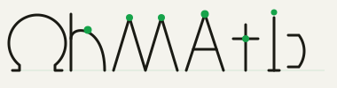

<p align="center">
  
</p>

<p align="center">
  Natural-language to circuit schematic — describe a circuit, get valid JSON you can render, validate, and export.
</p>

---

## What it is

Ohmatic takes a prompt like `"555 timer blinking LED at 1 Hz"` and returns a structured circuit JSON: components, nets, pin connections, and a BOM. The output is validated against a strict schema before it leaves the pipeline, so what you get is always well-formed.

The backend is a four-service pipeline:

```
prompt → gateway → inference → verifier → enricher → result
         :8080      :8001       :8002       :8003
```

| Service | Responsibility |
|---------|---------------|
| **gateway** | Accepts prompts, returns a job ID, orchestrates the pipeline |
| **inference** | Generates the circuit JSON from the prompt |
| **verifier** | Runs three-tier DRC — schema, geometry, electrical rules |
| **enricher** | Matches components to real parts, builds BOM |

## Getting started

```bash
git clone https://github.com/VittoriaLanzo/Ohmatic
cd Ohmatic
docker compose up
```

Submit a prompt:

```bash
curl -s -X POST http://localhost:8080/v1/generate \
  -H "Content-Type: application/json" \
  -d '{"prompt": "LED with 330 ohm resistor"}' | jq .
# {"job_id": "...", "poll_url": "/v1/jobs/.../status"}
```

Poll for the result:

```bash
curl -s http://localhost:8080/v1/jobs/<job_id>/status | jq .result.circuit
```

## Circuit schema

Every circuit is a JSON object with three required fields:

```json
{
  "metadata": {
    "title": "Blinking LED",
    "description": "555 timer driving an LED at 1 Hz",
    "version": "0.1",
    "tags": ["555", "led", "oscillator"]
  },
  "components": [
    {
      "id": "R1",
      "type": "resistor",
      "value": "330Ω",
      "part": "0603",
      "x": 50, "y": 50,
      "pins": {"1": "1", "2": "2"}
    }
  ],
  "nets": [
    {"name": "VCC", "pins": ["VCC1.1", "R1.1"]},
    {"name": "GND", "pins": ["R1.2", "GND1.1"]}
  ]
}
```

Full schema: [`shared/schema/circuit_v01.json`](shared/schema/circuit_v01.json)  
API contracts: [`shared/docs/contracts.md`](shared/docs/contracts.md)

## Validate a circuit

```bash
python dataset/validate.py dataset/examples.json
```

Or in Python:

```python
from dataset.validate import SchemaValidator

v = SchemaValidator()
errors = v.validate(circuit_dict)
```

## Project structure

```
Ohmatic/
├── gateway/stub/server.py          # Gateway service
├── inference/stub/server.py        # Inference service
├── verifier/stub/server.py         # Verifier / DRC service
├── enricher/stub/server.py         # Enricher / BOM service
│
├── shared/
│   ├── schema/circuit_v01.json     # Canonical circuit schema
│   ├── docs/contracts.md           # Service API contracts
│   ├── docs/log_schema.md          # Structured log event schema
│   └── ohmatic-types/              # Rust crate: circuit types + validate()
│
├── dataset/
│   ├── validate.py                 # Python reference validator
│   ├── examples.json               # Seed circuits
│   └── generate.py                 # Batch generation via API
│
├── training/
│   └── finetune.ipynb              # QLoRA fine-tuning notebook (Colab)
│
└── docker-compose.yml
```

## Status

| Layer | Status |
|-------|--------|
| Circuit schema v0.1 | done |
| Python validator (`validate.py`) | done |
| Rust types + `validate()` | done |
| Service contracts | done |
| Python stub servers | done |
| Rust service implementations | in progress |
| Fine-tuned inference model | in progress |

## License

MIT
