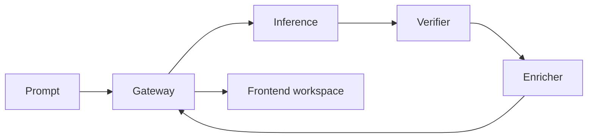

<p align="center">
  
</p>

<p align="center">
  Natural-language circuit generation: describe intent, get a checked schematic graph,
  DRC feedback, a BOM path, and a JSON contract the rest of the toolchain can trust.
</p>

---

## Quick Start

Clone, then run **one command**. It brings up the full local stack — backend + frontend, wired
together — and prints a URL you open in any browser.

```bash
git clone https://github.com/VittoriaLanzo/Ohmatic.git
cd Ohmatic
```

**Windows** (cmd or PowerShell):

```bat
ohmatic start
```

**Linux / macOS** (or Git Bash on Windows):

```bash
bash ohmatic start      # or: chmod +x ohmatic && ./ohmatic start
```

Open the printed `http://127.0.0.1:<port>` URL. That's the whole setup.

What `start` does for you, on any machine:

- finds a **working** Python 3 interpreter (skips broken/partial installs on `PATH`) and boots the
  four backend stubs — gateway, inference, verifier, enricher
- starts the frontend in **server mode**, so the browser talks to a real local gateway, not a mock
- **picks free ports automatically** — nothing is hardcoded, so a busy machine just works
- installs frontend dependencies on first run
- waits for the gateway to report healthy, then prints the URL

The only prerequisites are **Node.js + npm** (frontend) and **Python 3** (backend stubs). Docker is
optional. Not sure if your machine is ready? Run `ohmatic doctor` first.

### Commands

| Command | What it does |
|---------|--------------|
| `ohmatic start` | Full stack: Python backend stubs + frontend (server mode). |
| `ohmatic start -Mock` / `--mock` | Frontend only, mock data, no backend. |
| `ohmatic start -Docker` / `--docker` | Run the backend via `docker compose` instead of Python stubs. |
| `ohmatic stop` | Stop everything the launcher started. |
| `ohmatic status` | Show what is currently running, on which ports. |
| `ohmatic doctor` | Diagnose the machine (Node, Python, Docker, free ports) and give a verdict. |

`ohmatic doctor` is the cure for "works on my machine": it reports exactly what is present, missing,
or broken — for example a Python on `PATH` that cannot load its own stdlib — and tells you whether
the machine can run the stack.

> Cross-platform note: `ohmatic` (bash) targets Linux/macOS; `ohmatic.cmd` / `ohmatic.ps1` target
> Windows. Use the launcher native to your OS for reliable process management. State (pids, logs,
> chosen ports) lives in `.ohmatic-run/`.

---

## What Ohmatic Is

Ohmatic is an agentic electronics workbench. It takes prompts like:

```text
555 timer astable oscillator, 1 Hz LED blink, 5 V supply
```

and turns them into structured circuit artifacts:

- an `OhmaticCircuitV01` graph with components, nets, coordinates, and pin refs
- DRC output from schema, geometry, and electrical checks
- BOM rows ready for supplier enrichment
- a frontend workspace that renders the result as a schematic, parts table, checks panel, and JSON contract

The core idea is simple: natural language is allowed at the input, but the output must become typed,
validated, and inspectable before it is useful.

## Current Progress

Ohmatic is no longer just a prompt-to-JSON sketch. The repo has a real foundation layer, a verifier
implementation, service contracts, and a frontend generator workspace.

| Layer | Status | Notes |
|-------|--------|-------|
| Circuit schema v0.1 | Done | Canonical JSON schema and Rust types live under `shared/`. |
| Service contracts | Done | `shared/docs/contracts.md` is the source of truth for HTTP surfaces. |
| Verifier / DRC | Done for Stage 0 | Rust verifier implements the three-tier validation model. |
| Dataset seeds | Done for Stage 0 | Example circuits exercise schema and DRC behavior. |
| Frontend workspace | Done for v1 | React/Vite app with gateway adapter, mock mode, schematic graph, BOM, checks, JSON, animated logo. |
| Local launcher | Done | `ohmatic start` boots the full stack on Windows/Linux/macOS with dynamic ports. |
| Gateway orchestration | In progress | Public API shape is fixed; full live orchestration plugs into the existing channels. |
| Inference and enrichment | In progress | Internal services are contract-defined; production model/supplier paths are next. |

> The parser models (Qwen3-8B) are still training. The stubs return deterministic, schema-valid
> responses so the full toolchain — frontend, gateway shape, verifier, DRC — is usable today.

## Product Flow



The browser talks to the gateway only. It never calls inference, verifier, or enricher directly. In
local dev the Vite dev server proxies `/v1` and `/health` to the gateway's chosen port, so the
browser stays same-origin regardless of which port the gateway landed on.

## Frontend

The frontend lives in `frontend/` and opens directly into the generator workspace. It is built with
Vite, React, and TypeScript. `ohmatic start` runs it for you; to work on it directly:

```bash
cd frontend
npm install
npm run dev                       # mock mode if VITE_OHMATIC_USE_MOCK=1, else server mode
```

What it already supports:

- prompt composer and generation options
- gateway health check
- `POST /v1/generate`, polling through the returned `poll_url`, live pipeline status
- schematic SVG rendering from `result.circuit`
- DRC warning display from `result.drc_warnings`
- BOM table from `result.bom`, with a component-derived fallback while enrichment is offline
- JSON contract view from `result.circuit`
- mock adapter for backend-offline UI work
- reduced-motion support for the animated logo and PCB motion system

Environment variables:

| Variable | Purpose |
|----------|---------|
| `VITE_OHMATIC_USE_MOCK=1` | Use the in-browser mock adapter (no backend). |
| `VITE_OHMATIC_API_BASE_URL` | Point the browser client at an absolute gateway URL. |
| `OHMATIC_GATEWAY_URL` | Point the dev-server proxy at the gateway (set by the launcher for dynamic ports). |
| `VITE_OHMATIC_API_KEY` | When set, the frontend sends `Authorization: Bearer <token>`. |

## Backend Contract

The public gateway contract is:

| Method | Path | Purpose |
|--------|------|---------|
| `POST` | `/v1/generate` | Submit a natural-language circuit request. |
| `GET` | `/v1/jobs/{id}/status` | Poll async job status and final result. |
| `GET` | `/health` | Gateway liveness. |

`POST /v1/generate` returns:

```json
{
  "job_id": "01HWABCDE9876543210ABCDE01",
  "poll_url": "/v1/jobs/01HWABCDE9876543210ABCDE01/status"
}
```

Done jobs return:

```json
{
  "status": "done",
  "stage": null,
  "result": {
    "circuit": {},
    "drc_warnings": [],
    "bom": [],
    "latency_ms": { "inference": 2708, "drc": 42, "bom": 180 }
  },
  "error": null
}
```

Full contract: [`shared/docs/contracts.md`](shared/docs/contracts.md)

Each backend stub reads its port from the `OHMATIC_PORT` environment variable (default `8080`/`8001`/
`8002`/`8003`), which is how the launcher gives them dynamic ports. Running a stub directly:

```bash
OHMATIC_PORT=8080 python gateway/stub/server.py
```

Prefer the Docker topology? `ohmatic start -Docker` / `--docker` brings the same services up with
`docker compose`.

## Circuit Graph

The frontend schematic renderer expects the backend to return `OhmaticCircuitV01`:

```json
{
  "metadata": {
    "title": "Blinking LED",
    "description": "555 timer driving an LED at 1 Hz",
    "version": "0.1",
    "tags": ["555", "led", "oscillator"]
  },
  "components": [
    {
      "id": "R1",
      "type": "resistor",
      "value": "330 ohm",
      "part": "0603",
      "x": 50,
      "y": 50,
      "pins": { "1": "VCC", "2": "LED_A" }
    }
  ],
  "nets": [
    { "name": "VCC", "pins": ["VCC1.1", "R1.1"] }
  ]
}
```

Important graph rules:

- component IDs must be stable and unique
- net pins must use `ComponentId.PinName`
- component coordinates are used for schematic placement
- backend BOM rows should use component IDs so the Parts table can line up with the circuit graph

Schema: [`shared/schema/circuit_v01.json`](shared/schema/circuit_v01.json)

## Verification

Frontend:

```bash
cd frontend
npm run test
npm run build
npm run lint
```

Verifier and shared Rust crates:

```bash
cargo test --workspace
```

Dataset validation:

```bash
python dataset/validate.py dataset/examples.json
```

## Repository Map

```text
Ohmatic/
  ohmatic / ohmatic.cmd / ohmatic.ps1   One-command local launcher (POSIX + Windows)
  frontend/                    Vite + React generator workspace
  gateway/                     Public API gateway service (stub under gateway/stub)
  inference/                   Prompt-to-circuit generation service
  verifier/                    Three-tier DRC verifier
  enricher/                    BOM and supplier enrichment service
  shared/
    schema/circuit_v01.json    Canonical circuit schema
    docs/contracts.md          Public and internal HTTP contracts
    ohmatic-types/             Rust circuit types and validation
  dataset/                     Seed circuits and validation helpers
  assets/                      Brand and README media
  docker-compose.yml           Local service stack (used by `ohmatic start -Docker`)
```

## Contributing

Read [`shared/docs/contracts.md`](shared/docs/contracts.md) before changing any service boundary.
Contract drift is the fastest way to break Ohmatic.

Useful contributions right now:

- richer seed circuits in `dataset/examples.json`
- more component symbols and routing improvements for the schematic renderer
- gateway orchestration against live inference, verifier, and enricher services
- schema-aware JSON inspection in the frontend Contract panel
- supplier enrichment adapters for production BOM data

For schema or contract changes, update the Rust types, JSON schema, dataset validation path, and
frontend TypeScript types together.

## Citation

```bibtex
@software{ohmatic,
  title   = {Ohmatic: Natural-Language Circuit Schematic Generator},
  author  = {Lanzo, Vittoria},
  year    = {2026},
  url     = {https://github.com/VittoriaLanzo/Ohmatic}
}
```

## License

See [`LICENSE`](LICENSE).
