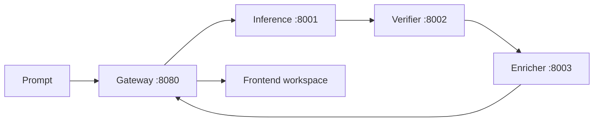

<p align="center">
  
</p>

<p align="center">
  Natural-language circuit generation: describe intent, get a checked schematic graph,
  DRC feedback, a BOM path, and a JSON contract the rest of the toolchain can trust.
</p>

---

## What Ohmatic Is

Ohmatic is an agentic electronics workbench. It takes prompts like:

```text
555 timer astable oscillator, 1 Hz LED blink, 5 V supply
```

and turns them into structured circuit artifacts:

- an `OhmaticCircuitV01` graph with components, nets, coordinates, and pin refs
- DRC output from schema, geometry, and electrical checks
- BOM rows ready for supplier enrichment
- a frontend workspace that renders the result as a schematic, parts table, checks panel, and JSON contract

The core idea is simple: natural language is allowed at the input, but the output must become typed, validated, and inspectable before it is useful.

## Current Progress

Ohmatic is no longer just a prompt-to-JSON sketch. The repo now has a real foundation layer, a verifier implementation, service contracts, and a frontend generator workspace.

| Layer | Status | Notes |
|-------|--------|-------|
| Circuit schema v0.1 | Done | Canonical JSON schema and Rust types live under `shared/`. |
| Service contracts | Done | `shared/docs/contracts.md` is the source of truth for HTTP surfaces. |
| Verifier / DRC | Done for Stage 0 | Rust verifier implements the three-tier validation model. |
| Dataset seeds | Done for Stage 0 | Example circuits exercise schema and DRC behavior. |
| Frontend workspace | Done for v1 | React/Vite app with gateway adapter, mock mode, schematic graph, BOM, checks, JSON, and animated logo. |
| Gateway orchestration | In progress | Public API shape is fixed; full live orchestration plugs into the existing channels. |
| Inference and enrichment | In progress | Internal services are contract-defined; production model/supplier paths are next. |

## Product Flow



The browser talks to the gateway only. It never calls inference, verifier, or enricher directly.

## Frontend

The frontend lives in `frontend/` and opens directly into the generator workspace. It is built with Vite, React, and TypeScript.

What it already supports:

- prompt composer and generation options
- gateway health check
- `POST /v1/generate`
- polling through returned `poll_url`
- live pipeline status
- schematic SVG rendering from `result.circuit`
- DRC warning display from `result.drc_warnings`
- BOM table from `result.bom`, with a component-derived fallback while enrichment is offline
- JSON contract view from `result.circuit`
- mock adapter for backend-offline UI work
- reduced-motion support for the animated logo and PCB motion system

Run it in mock mode:

```bash
cd frontend
npm install
npm run dev
```

PowerShell mock mode:

```powershell
cd frontend
$env:VITE_OHMATIC_USE_MOCK="1"
npm run dev
```

Connect it to a gateway:

```bash
VITE_OHMATIC_API_BASE_URL=http://localhost:8080 npm run dev
```

Production or server mode can optionally provide:

```text
VITE_OHMATIC_API_KEY=<token>
```

When present, the frontend sends `Authorization: Bearer <token>`.

## Backend Contract

The public gateway contract is:

| Method | Path | Purpose |
|--------|------|---------|
| `POST` | `/v1/generate` | Submit a natural-language circuit request. |
| `GET` | `/v1/jobs/{id}/status` | Poll async job status and final result. |
| `GET` | `/health` | Gateway liveness. |

`POST /v1/generate` returns:

```json
{
  "job_id": "01HWABCDE9876543210ABCDE01",
  "poll_url": "/v1/jobs/01HWABCDE9876543210ABCDE01/status"
}
```

Done jobs return:

```json
{
  "status": "done",
  "stage": null,
  "result": {
    "circuit": {},
    "drc_warnings": [],
    "bom": [],
    "latency_ms": {
      "inference": 2708,
      "drc": 42,
      "bom": 180
    }
  },
  "error": null
}
```

Full contract: [`shared/docs/contracts.md`](shared/docs/contracts.md)

## Circuit Graph

The frontend schematic renderer expects the backend to return `OhmaticCircuitV01`:

```json
{
  "metadata": {
    "title": "Blinking LED",
    "description": "555 timer driving an LED at 1 Hz",
    "version": "0.1",
    "tags": ["555", "led", "oscillator"]
  },
  "components": [
    {
      "id": "R1",
      "type": "resistor",
      "value": "330 ohm",
      "part": "0603",
      "x": 50,
      "y": 50,
      "pins": {
        "1": "VCC",
        "2": "LED_A"
      }
    }
  ],
  "nets": [
    {
      "name": "VCC",
      "pins": ["VCC1.1", "R1.1"]
    }
  ]
}
```

Important graph rules:

- component IDs must be stable and unique
- net pins must use `ComponentId.PinName`
- component coordinates are used for schematic placement
- backend BOM rows should use component IDs so the Parts table can line up with the circuit graph

Schema: [`shared/schema/circuit_v01.json`](shared/schema/circuit_v01.json)

## Local Backend

Start the service stack:

```bash
docker compose up
```

Submit a prompt:

```bash
curl -s -X POST http://localhost:8080/v1/generate \
  -H "Content-Type: application/json" \
  -d '{"prompt": "LED with 330 ohm resistor"}'
```

Poll the returned URL:

```bash
curl -s http://localhost:8080/v1/jobs/<job_id>/status
```

Note: Docker currently starts the public service stubs. The frontend contract is already aligned with the gateway shape, so replacing the stubs with live orchestration should not require browser-facing API changes.

## Verification

Frontend:

```bash
cd frontend
npm run test
npm run build
npm run lint
```

Verifier and shared Rust crates:

```bash
cargo test --workspace
```

Dataset validation:

```bash
python dataset/validate.py dataset/examples.json
```

## Repository Map

```text
Ohmatic/
  frontend/                    Vite + React generator workspace
  gateway/                     Public API gateway service
  inference/                   Prompt-to-circuit generation service
  verifier/                    Three-tier DRC verifier
  enricher/                    BOM and supplier enrichment service
  shared/
    schema/circuit_v01.json    Canonical circuit schema
    docs/contracts.md          Public and internal HTTP contracts
    ohmatic-types/             Rust circuit types and validation
  dataset/                     Seed circuits and validation helpers
  assets/                      Brand and README media
  docker-compose.yml           Local service stack
```

## Contributing

Read [`shared/docs/contracts.md`](shared/docs/contracts.md) before changing any service boundary. Contract drift is the fastest way to break Ohmatic.

Useful contributions right now:

- richer seed circuits in `dataset/examples.json`
- more component symbols and routing improvements for the schematic renderer
- gateway orchestration against live inference, verifier, and enricher services
- schema-aware JSON inspection in the frontend Contract panel
- supplier enrichment adapters for production BOM data

For schema or contract changes, update the Rust types, JSON schema, dataset validation path, and frontend TypeScript types together.

## Citation

```bibtex
@software{ohmatic,
  title   = {Ohmatic: Natural-Language Circuit Schematic Generator},
  author  = {Lanzo, Vittoria},
  year    = {2026},
  url     = {https://github.com/VittoriaLanzo/Ohmatic}
}
```

## License

Ohmatic is licensed under the GNU Affero General Public License v3.0. See [`LICENSE`](LICENSE).
