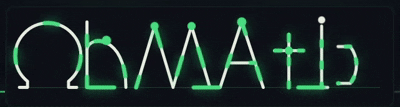
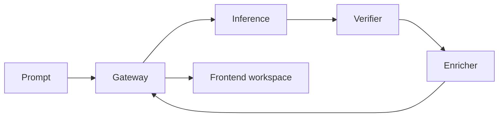

<p align="center">
  
</p>

<p align="center">
  Natural-language circuit generation: describe the intent, get a validated schematic graph,
  DRC feedback, a BOM path, and a JSON contract the rest of the toolchain can rely on.
</p>

---

## Quick Start

A fresh clone runs with a single command. It starts the backend and frontend together and prints a
local URL.

```bash
git clone https://github.com/VittoriaLanzo/Ohmatic.git
cd Ohmatic
```

Windows (cmd or PowerShell):

```bat
ohmatic start
```

Linux or macOS (or Git Bash on Windows):

```bash
bash ohmatic start      # or: chmod +x ohmatic && ./ohmatic start
```

Open the printed `http://127.0.0.1:<port>` URL.

`ohmatic start` boots the four backend stubs (gateway, inference, verifier, enricher) and the
frontend in server mode, so the browser talks to a real local gateway rather than a mock. It selects
free ports automatically, installs frontend dependencies on first run, and waits for the gateway to
report healthy before printing the URL.

### Requirements

Node.js with npm (frontend) and Python 3 (backend stubs). Docker is optional and only used by the
`-Docker` mode. Run `ohmatic doctor` to check the environment before starting; it reports missing or
non-functional tooling — including a Python on `PATH` that cannot load its standard library — and
whether the machine can run the stack.

### Commands

| Command | Description |
|---------|-------------|
| `ohmatic start` | Start the full stack: Python backend stubs plus the frontend in server mode. |
| `ohmatic start -Mock` / `--mock` | Start the frontend only, with mock data and no backend. |
| `ohmatic start -Docker` / `--docker` | Start the backend with `docker compose` instead of Python stubs. |
| `ohmatic stop` | Stop everything the launcher started. |
| `ohmatic status` | Show which services are running, and on which ports. |
| `ohmatic doctor` | Diagnose Node, Python, Docker, and ports, and report whether the stack can run. |

The bash launcher (`ohmatic`) targets Linux and macOS; `ohmatic.cmd` / `ohmatic.ps1` target Windows.
Use the launcher native to the operating system for reliable process management. Run state — process
IDs, logs, and the selected ports — is written to `.ohmatic-run/`.

## What Ohmatic Is

Ohmatic is an agentic electronics workbench. It takes a prompt such as:

```text
555 timer astable oscillator, 1 Hz LED blink, 5 V supply
```

and turns it into structured circuit artifacts:

- an `OhmaticCircuitV01` graph with components, nets, coordinates, and pin references
- DRC output from schema, geometry, and electrical checks
- BOM rows ready for supplier enrichment
- a frontend workspace that renders the result as a schematic, a parts table, a checks panel, and the JSON contract

Natural language is accepted at the input, but the output is typed, validated, and inspectable before
it is treated as usable.

## Status

| Layer | Status | Notes |
|-------|--------|-------|
| Circuit schema v0.1 | Complete | Canonical JSON schema and Rust types under `shared/`. |
| Service contracts | Complete | `shared/docs/contracts.md` is the source of truth for HTTP surfaces. |
| Verifier / DRC | Complete (Stage 0) | Rust verifier implementing the three-tier validation model. |
| Dataset seeds | Complete (Stage 0) | Example circuits exercise schema and DRC behavior. |
| Frontend workspace | Complete | React/Vite app: gateway adapter, mock mode, schematic graph, BOM, checks, JSON view. |
| Local launcher | Complete | `ohmatic start` runs the full stack on Windows, Linux, and macOS with dynamic ports. |
| Gateway orchestration | In progress | The public API shape is fixed; live orchestration plugs into the existing channels. |
| Inference and enrichment | In progress | Internal services are contract-defined; production model and supplier paths are next. |

The parser model (Qwen3-8B) is still in training. The stubs return deterministic, schema-valid
responses, so the toolchain — frontend, gateway shape, verifier, and DRC — is usable today.

## Architecture



The browser communicates only with the gateway; it never calls inference, verifier, or enricher
directly. In local development the Vite dev server proxies `/v1` and `/health` to the gateway, so the
browser remains same-origin regardless of which port the gateway is running on.

## Frontend

The frontend lives in `frontend/` and opens directly into the generator workspace. It is built with
Vite, React, and TypeScript. `ohmatic start` runs it as part of the stack; to work on it on its own:

```bash
cd frontend
npm install
npm run dev    # server mode (expects a gateway on :8080); set VITE_OHMATIC_USE_MOCK=1 for the mock
```

Current capabilities:

- prompt composer and generation options
- gateway health check
- `POST /v1/generate`, polling through the returned `poll_url`, and live pipeline status
- schematic rendering from `result.circuit`, with ANSI and IEC symbols for every component type
- DRC warnings from `result.drc_warnings`
- BOM table from `result.bom`, with a component-derived fallback while enrichment is offline
- JSON contract view from `result.circuit`
- a mock adapter for backend-offline UI work
- reduced-motion support for the animated logo and motion system

Environment variables:

| Variable | Purpose |
|----------|---------|
| `VITE_OHMATIC_USE_MOCK=1` | Use the in-browser mock adapter instead of a backend. |
| `VITE_OHMATIC_API_BASE_URL` | Point the browser client at an absolute gateway URL. |
| `OHMATIC_GATEWAY_URL` | Point the dev-server proxy at the gateway; set automatically by the launcher for dynamic ports. |
| `VITE_OHMATIC_API_KEY` | When set, the frontend sends `Authorization: Bearer <token>`. |

## Backend Contract

The public gateway contract:

| Method | Path | Purpose |
|--------|------|---------|
| `POST` | `/v1/generate` | Submit a natural-language circuit request. |
| `GET` | `/v1/jobs/{id}/status` | Poll job status and the final result. |
| `GET` | `/health` | Gateway liveness. |

`POST /v1/generate` returns:

```json
{
  "job_id": "01HWABCDE9876543210ABCDE01",
  "poll_url": "/v1/jobs/01HWABCDE9876543210ABCDE01/status"
}
```

A completed job returns:

```json
{
  "status": "done",
  "stage": null,
  "result": {
    "circuit": {},
    "drc_warnings": [],
    "bom": [],
    "latency_ms": { "inference": 2708, "drc": 42, "bom": 180 }
  },
  "error": null
}
```

Full contract: [`shared/docs/contracts.md`](shared/docs/contracts.md).

Each backend stub binds the port given by the `OHMATIC_PORT` environment variable, defaulting to
`8080` (gateway), `8001` (inference), `8002` (verifier), and `8003` (enricher). The launcher uses
this to assign free ports; run a stub directly with:

```bash
OHMATIC_PORT=8080 python gateway/stub/server.py
```

`ohmatic start -Docker` / `--docker` brings the same services up with `docker compose`.

## Circuit Graph

The schematic renderer expects the gateway to return an `OhmaticCircuitV01` graph:

```json
{
  "metadata": {
    "title": "Blinking LED",
    "description": "555 timer driving an LED at 1 Hz",
    "version": "0.1",
    "tags": ["555", "led", "oscillator"]
  },
  "components": [
    {
      "id": "R1",
      "type": "resistor",
      "value": "330 ohm",
      "part": "0603",
      "x": 50,
      "y": 50,
      "pins": { "1": "VCC", "2": "LED_A" }
    }
  ],
  "nets": [
    { "name": "VCC", "pins": ["VCC1.1", "R1.1"] }
  ]
}
```

Graph rules:

- component IDs are stable and unique
- net pins use `ComponentId.PinName`
- component coordinates drive schematic placement
- BOM rows reference component IDs so the parts table aligns with the graph

Schema: [`shared/schema/circuit_v01.json`](shared/schema/circuit_v01.json).

## Development

Frontend:

```bash
cd frontend
npm run test     # vitest
npm run lint     # TypeScript type-check
npm run build    # type-check and production bundle
```

Rust verifier and shared crates:

```bash
cargo test --workspace
```

Dataset validation:

```bash
python dataset/validate.py dataset/examples.json
```

## Repository Layout

```text
Ohmatic/
  ohmatic, ohmatic.cmd, ohmatic.ps1   One-command local launcher (POSIX and Windows)
  frontend/                           Vite + React generator workspace
  gateway/                            Public API gateway service (stub under gateway/stub)
  inference/                          Prompt-to-circuit generation service
  verifier/                           Three-tier DRC verifier
  enricher/                           BOM and supplier enrichment service
  shared/
    schema/circuit_v01.json           Canonical circuit schema
    docs/contracts.md                 Public and internal HTTP contracts
    ohmatic-types/                    Rust circuit types and validation
  dataset/                            Seed circuits and validation helpers
  assets/                             Brand and README media
  docker-compose.yml                  Local service stack (used by `ohmatic start -Docker`)
```

## Contributing

Read [`shared/docs/contracts.md`](shared/docs/contracts.md) before changing any service boundary;
contract drift is the most common way to break the toolchain. When changing the schema or a contract,
update the Rust types, the JSON schema, the dataset validation path, and the frontend TypeScript
types together.

Areas that are open for contribution:

- richer seed circuits in `dataset/examples.json`
- additional component symbols and routing improvements in the schematic renderer
- gateway orchestration against live inference, verifier, and enricher services
- schema-aware inspection in the frontend Contract panel
- supplier enrichment adapters for production BOM data

## Citation

```bibtex
@software{ohmatic,
  title   = {Ohmatic: Natural-Language Circuit Schematic Generator},
  author  = {Lanzo, Vittoria},
  year    = {2026},
  url     = {https://github.com/VittoriaLanzo/Ohmatic}
}
```

## License

Functional Source License 1.1 (FSL-1.1), converting to Apache 2.0 on 2036-06-02. You may use, modify,
and redistribute the software and sell its outputs (schematics, designs, and other generated
artifacts); a competing-use restriction applies until the change date. See [`LICENSE`](LICENSE) for
the full terms.
